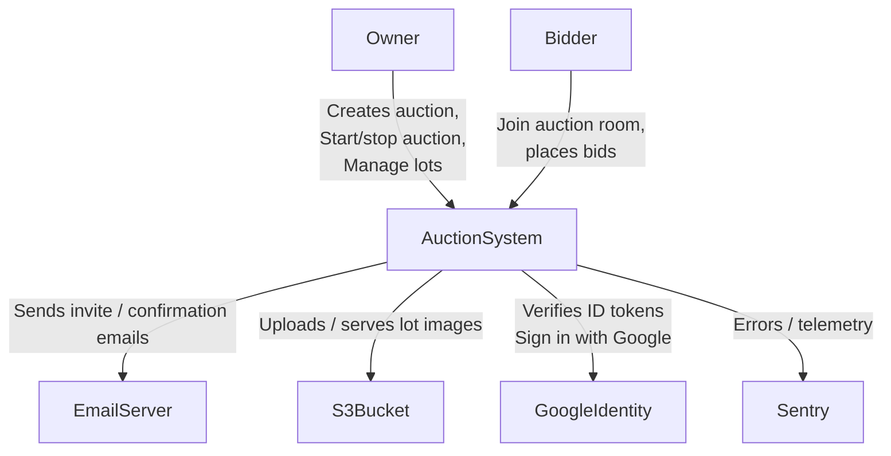
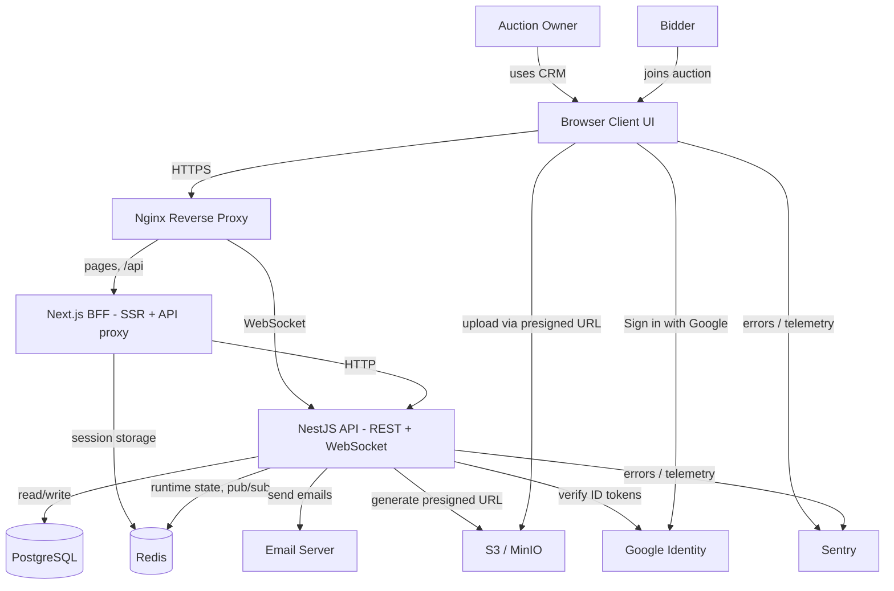
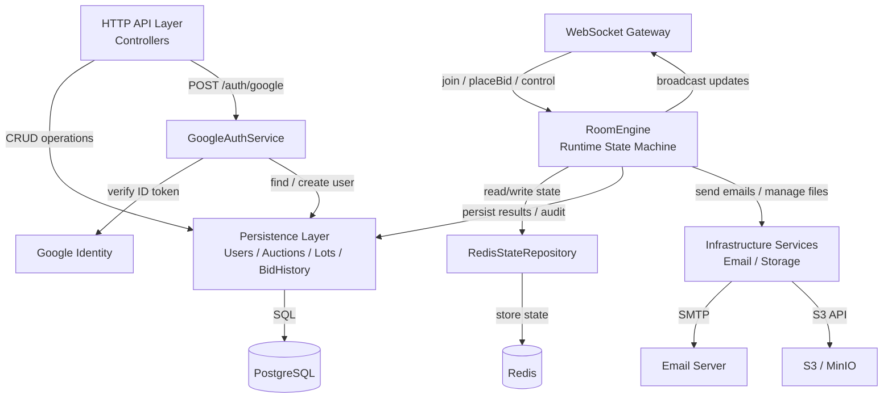
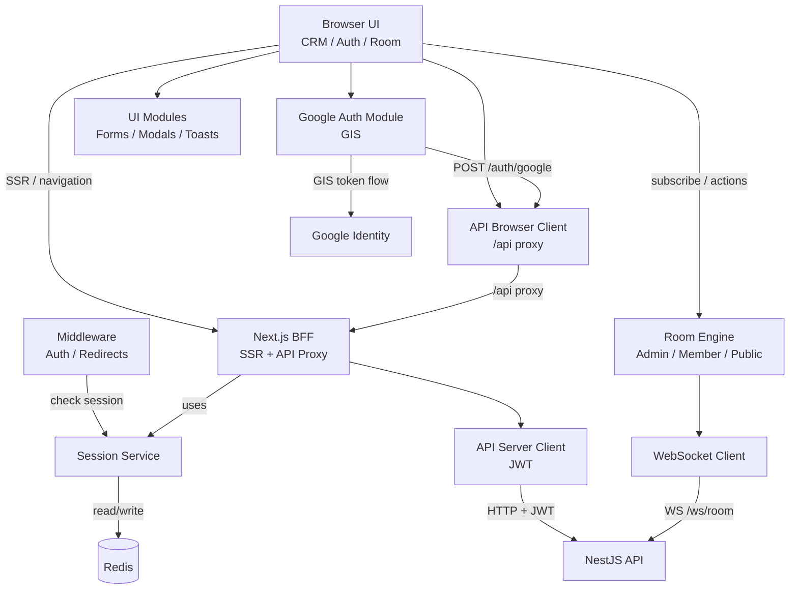

# Auction Hub — C4 Architecture Diagrams

## Level 1: System Context

```mermaid
graph TD
    Owner -->|Creates auction,\n Start/stop auction,\n Manage lots| AuctionSystem
    Bidder -->|Join auction room,\n places bids| AuctionSystem
    AuctionSystem -->|Sends invite / confirmation emails| EmailServer
    AuctionSystem -->|Uploads / serves lot images | S3Bucket
    AuctionSystem -->|Verifies ID tokens\n Sign in with Google| GoogleIdentity
    AuctionSystem -->|Errors / telemetry| Sentry
```

## Level 2: Container

```mermaid
graph TD

%% Actors
    Owner[Auction Owner]
    Bidder[Bidder]

%% Client layer
    Browser[Browser Client UI]
    Nginx[Nginx Reverse Proxy]
    BFF[Next.js BFF - SSR + API proxy]

%% Backend
    API[NestJS API - REST + WebSocket]

%% Data
    Postgres[(PostgreSQL)]
    Redis[(Redis)]
    S3[S3 / MinIO]
    Email[Email Server]
    Google[Google Identity]
    Sentry[Sentry]

%% User interaction
    Owner -->|uses CRM| Browser
    Bidder -->|joins auction| Browser

%% Client flow
    Browser -->|HTTPS| Nginx
    Nginx -->|pages, /api| BFF
    Nginx -->|WebSocket| API
    BFF -->|HTTP| API

%% Session handling
    BFF -->|session storage| Redis

%% Backend data
    API -->|read/write| Postgres
    API -->|runtime state, pub/sub| Redis

%% External integrations
    API -->|send emails| Email
    API -->|generate presigned URL| S3
    API -->|verify ID tokens| Google

%% Direct browser integrations
    Browser -->|Sign in with Google| Google
    Browser -->|upload via presigned URL| S3

%% Observability
    Browser -->|errors / telemetry| Sentry
    API -->|errors / telemetry| Sentry
```

## Level 3: Component — NestJS API

```mermaid
graph TD

%% Layers
HTTP[HTTP API Layer<br/>Controllers]
WS[WebSocket Gateway]

GOOGLE_AUTH[GoogleAuthService]

ENGINE[RoomEngine<br/>Runtime State Machine]

REDIS_REPO[RedisStateRepository]

PERSISTENCE[Persistence Layer<br/>Users / Auctions / Lots / BidHistory]

INFRA[Infrastructure Services<br/>Email / Storage]

%% Databases
Redis[(Redis)]
Postgres[(PostgreSQL)]
Email[Email Server]
S3[S3 / MinIO]
Google[Google Identity]

%% Flows

%% HTTP (CRUD)
HTTP -->|CRUD operations| PERSISTENCE

%% Google auth
HTTP -->|POST /auth/google| GOOGLE_AUTH
GOOGLE_AUTH -->|verify ID token| Google
GOOGLE_AUTH -->|find / create user| PERSISTENCE

%% WS → Engine
WS -->|join / placeBid / control| ENGINE

%% Engine → State
ENGINE -->|read/write state| REDIS_REPO
REDIS_REPO -->|store state| Redis

%% Engine → DB
ENGINE -->|persist results / audit| PERSISTENCE
PERSISTENCE -->|SQL| Postgres

%% Engine → WS
ENGINE -->|broadcast updates| WS

%% Engine → Infra
ENGINE -->|send emails / manage files| INFRA
INFRA -->|SMTP| Email
INFRA -->|S3 API| S3
```

## Level 3: Component — Next.js Client

```mermaid
graph TD

%% UI
    UI[Browser UI<br/>CRM / Auth / Room]

%% BFF
    BFF[Next.js BFF<br/>SSR + API Proxy]

    Middleware[Middleware<br/>Auth / Redirects]
    Session[Session Service]

%% API clients
    ApiServer[API Server Client<br/>JWT]
    ApiClient[API Browser Client<br/>/api proxy]

%% Realtime
    Engine[Room Engine<br/>Admin / Member / Public]
    Socket[WebSocket Client]

%% Google Sign-In
    GAuth[Google Auth Module<br/>GIS]

%% UI modules
    UIX[UI Modules<br/>Forms / Modals / Toasts]

%% External
    Redis[(Redis)]
    API[NestJS API]
    Google[Google Identity]

%% Flow

%% Browser → BFF
    UI -->|SSR / navigation| BFF

%% Middleware
    Middleware -->|check session| Session

%% Sessions
    BFF -->|uses| Session
    Session -->|read/write| Redis

%% API (server)
    BFF --> ApiServer
    ApiServer -->|HTTP + JWT| API

%% API (client)
    UI --> ApiClient
    ApiClient -->|/api proxy| BFF

%% Room Engine + WebSocket
    UI -->|subscribe / actions| Engine
    Engine --> Socket
    Socket -->|WS /ws/room| API

%% Google Sign-In
    UI --> GAuth
    GAuth -->|GIS token flow| Google
    GAuth -->|POST /auth/google| ApiClient

%% UI modules
    UI --> UIX
```
